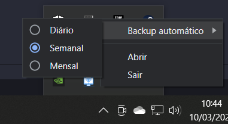
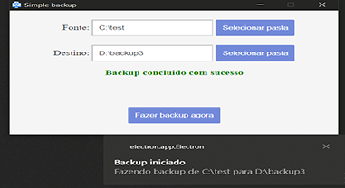
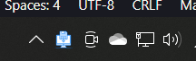

# Simple Backup

Simple Backup é uma aplicação para Windows que busca trazer, de forma simples, uma solução para fazer backup de diretórios de arquivos em sistemas operacionais Windows.


## Instalação

Clone este repositório

```bash
  git clone https://github.com/MoonDusk1996/windows-backup-software
```

Navegue até o ditretorio da aplicação

```bash
  cd windows-backup-software
```

Inicialize a aplicação

```bash
  npm i
```
Execute a aplicação

```bash
  npm run start
```

## Funcionalidades

- Backups automáticos:


- Notificações de backups:


- Segundo plano:



## Tecnologias utilizadas

**Linguagem:** JavaScript .

**Framework:** Electron.Js.

